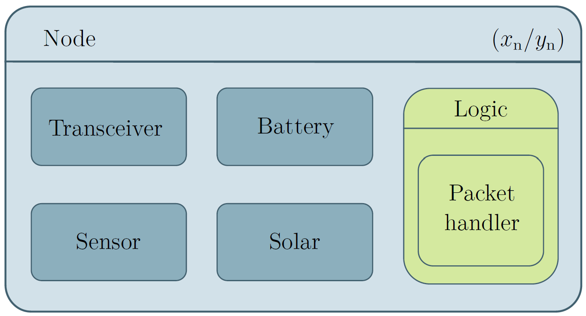
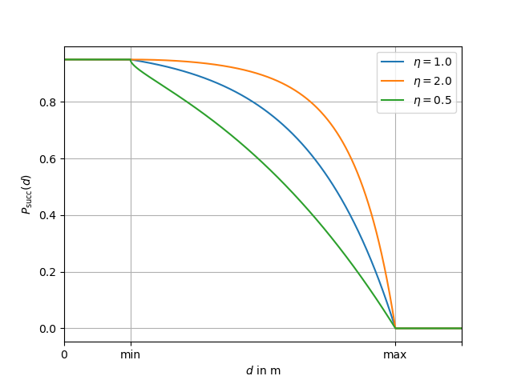
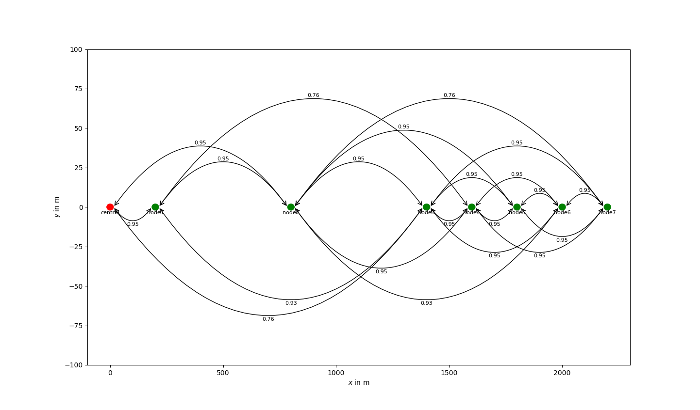
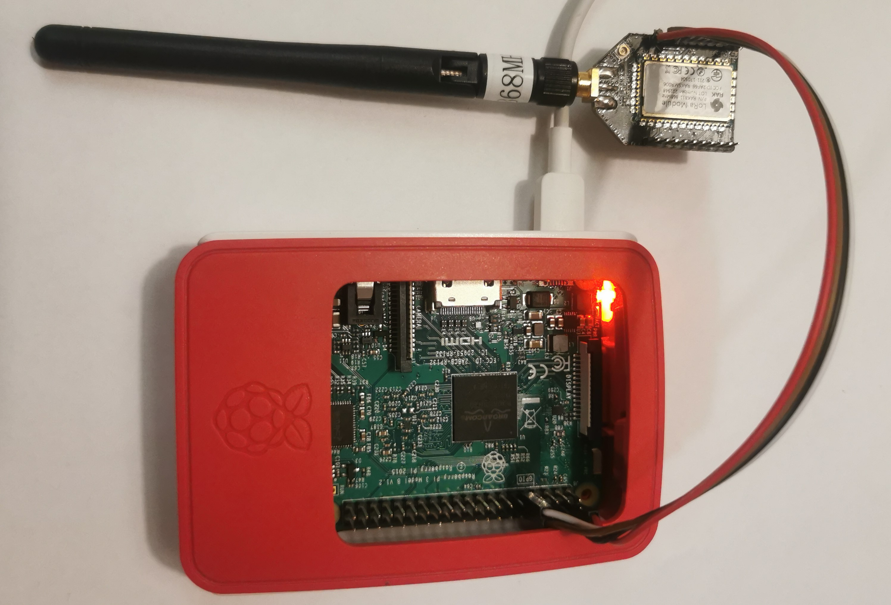
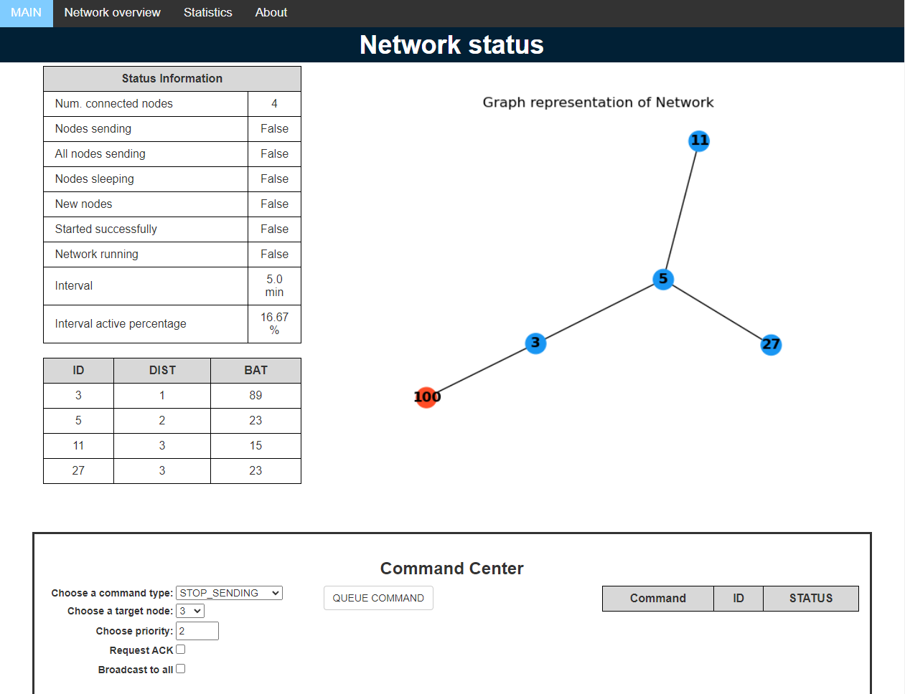
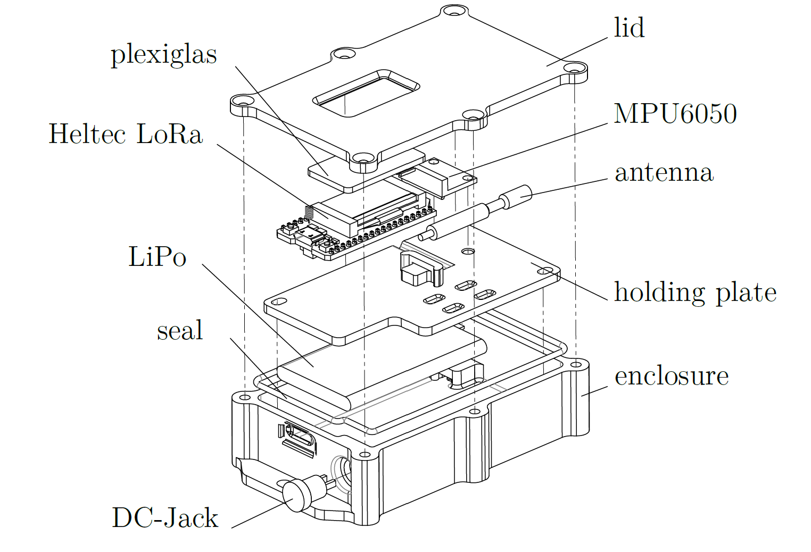

# LoRa MeshNetwork

This repository contains an approach to create a wireless mesh network (WMN) on the basis of the LoRa modulation from Semtech. It was developed during the work on my master's thesis.

The main parts are:
* Simulator for LoRa nodes
* C++ code for ESP32 + Semtech SX1276
* Python code for RaspberryPi + RAK811 as gateway with web interface for controlling the network

# Overview

Many options exist to set up a wireless mesh network, but not all are suited to low-power and long-range applications. I chose an interval-based communication principle with distance-based routing. This was the best fit for my use-case, transmission line monitoring. Even if this might not fit your application, the simulator might be useful to experiment with other application / routing algorithms.

# Simulation

The simulation is entity-based, with the entities being located at a specific position in a two-dimensional world. Simulating is done time-based and not event-based. This results in a longer run-time for the simulation, but it allows the simulation code to be easily ported to the real hardware later.

Every node is an entity in the world with a specific two-dimensional position defined by x_n and y_n coordinates. It acts as a container for multiple other objects. These objects are used to emulate the real hardware of the sensor nodes, like the sensor, battery, and transceiver module. The transceiver is handling all the communication and can be accessed through interfaces similar to the real LoRa transceivers. This will allow the development of the software stack using the simulation rather than always performing a hardware test. To make switching between different protocol implementations easier, the software is modeled as a container called *logic*. This *logic* module contains another module called the *packet handler* that is responsible for handling all incoming packets. This creates a modular system that can easily be adapted to test different designs.

<p align="center">

</p>

A simulation world is used to create a common reference frame and handle the transmission parameters.

## Example

Running a simulation is structured in 3 phases:
* Creating the scenario
* Running the simulation
* Evaluating the simulation results

We will go through these 3 phases for an example scenario. Any scenario will be created using the *configuration_manager*. With it, we can add nodes to the world and specify the logic that they are running.

### Configuration

For this example we will be using the scenario defined in *create_configuration_thesis.py*. It defines a network with seven sensor nodes connected to a single gateway. They are using the mesh protocol developed in my master's thesis.

First we define the name of our scenario and the unique identifier for our network:

```Python
config_name = "world_thesis"
appID = 123
```

After this the transmission model for our scenario is defined by these parameters:

```Python
SF = 7
tx_min = 1500
tx_max = 2200
tx_error_rate = 0.05
tx_decay = 2
```

The spreading factor SF is the most important parameter influencing the transmission model. It defines the trade-off between communication range and data rate. It can be chosen between 7 and 12, where 7 is the shortest range and 12 is the longest. In the simulation for each SF a minimum and maximum communication range is defined. To simulate other channel qualities the minimum and maximum transmission range can also be set manually. Between these two distances the probability of a successful transmission drops from 1 minus the static error *tx_error_rate* to zero. The speed of the drop-off can be adjusted by *tx_decay*. Overall this leads to the following transmission model:

<p align="center">

</p>

After defining our transmission model and configuration name, we can start adding nodes to the simulation. Each node is an entity in the simulation world, that gets updated every millisecond. Every node has a *logic* object defining its behavior, much like the code on a microcontroller would. The following code creates and adds a node with the logic for setting up the LoRa mesh network (LMN) proposed in my master's thesis:

```Python
cmanager.register_node(node_sensor(
    1,
    "node1",
    logic_node_lmn(appID, 1, handler=handler_lmn(), spreading_f=SF),
    sensor(Sensor_Type.TEMP),
    batt=battery(1200,1.0),
    x=200,
    y=0,
))
```

The node has the node ID 1 and is placed at (200,0). With this method the other six sensor nodes are added. Then to actually create the network, a gateway needs to be added. This is only different to the sensor nodes in the used logic. After adding all nodes, the scenario looks as follows:

<p align="center">

</p>

Every arrow represents a communication link between the nodes and the number is the likelihood of a successful transmission.

At the end of the configuration further options are blocking communication links between nodes with:
```Python
cmanager.register_block(4,9)
```
or the option to specify events that are happening in the simulation at a pre-defined time:
```Python
cmanager.register_event(event_reset(cmanager.world_time + 1000*60*60*1.2, 5))
cmanager.register_event(event_command(cmanager.world_time + 1000*60*60*2.2, nack_command(0, Command_type.ENABLE_SLEEP, prio=2)))
```

### Running the simulation

To run the simulation a simulation object is created from the saved configuration file. Then this simulation can be simulated for a specified time. An example for doing this is shown in */simulation/run.py*. The simulation is printing time-stamped debugging information in the console. 

### Evaluation

After running the simulation, the simulation object also the built-in methods to evaluate the performance of the network regarding the packet delivery ratio (PDR).

For the evaluation to work properly the debug name of the packet to be tracked needs to be set as:
```Python
debug_name = node.name + "_" + send_cnt
```
Where *send_cnt* shall be an integer to uniquely identify the packet. A packet can be sent with the same debug_name, but then it will only be counted once in the analysis. This was used for resending packets when they were corrupted during transmission.

# Hardware

The hardware used for the network were Heltec LoRa 32 (V2) development boards for the sensor nodes and a RaspberryPi with a RAK811 LoRa module for the central node. Both of these use the SX1276 LoRa transceiver module from Semtech, guaranteeing that the transmissions are not impaired by Incompatibilities. To enable outdoor testing of the network a 3D-printable case was designed to waterproof the assembled sensor nodes.

## RaspberryPi

The central node was realized with a RaspberryPi together with a RAK811 LoRa transceiver module for the LoRa communication. It was programmed in Python to re-use the code from the simulation.

<p align="center">

</p>

A small web server is running on the Pi to visualize the status of the network. On port 5000 a table of received packets is displayed and on port 5001 a control interface with the current network status is hosted.

<p align="center">

</p>

To set up the RaspberryPi create the following structure under the username:
```
/project/server/logs
```

Additionally, install the following packets:
* rak811 (see below)
* Flask
* numpy
* matplotlib
* networkx

To upload the code to the RaspberryPi run */RaspberryPi/upload_to_pi.py*.

For connecting the RAK811 see this resource:
* https://github.com/AmedeeBulle/pyrak811

## Heltec LoRa 32

The sensor nodes are based on the Heltec LoRa 32 (V2) development board with an ESP32 microcontroller, integrated USB to serial interface and a charge controller for Li-Po batteries. This is already all that is needed to create the sensor nodes except the sensors themselves. It is possible to connect a large variety of sensors to the ESP32 microcontroller via common interfaces like SPI and I2C. For testing the network the MPU6050 inertial measurement unit (IMU) was used.

<p align="center">

</p>

The C++ code for the ESP32 was developed using the PlatformIO plugin for Visual Studio Code. I recommend these resources to get started:
* https://docs.platformio.org/en/stable/integration/ide/vscode.html
* https://docs.platformio.org/en/latest/platforms/espressif32.html